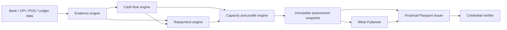

# FinMitra

> Evidence-backed financial assessment, goal planning, and privacy-conscious credentials for borrowers whose financial lives do not fit neatly into a traditional credit file.

[](https://www.python.org/)
[](https://fastapi.tiangolo.com/)
[](https://react.dev/)
[](#testing)

FinMitra turns fragmented financial evidence—bank statements, UPI records, ledgers, marketplace settlements, and declared informal loans—into an auditable financial profile. It combines four independent assessment engines with a deterministic **What If** planner and a selectively disclosed **Financial Passport**.

The system is designed to be conservative: missing history stays unknown, unresolved repayment problems remain hard blocks, and planning results never override the underlying assessment.

## What it does

- **Evidence verification:** normalizes, deduplicates, validates, and grades financial records.
- **Cash-flow assessment:** derives the locked feature set and estimates 90-day cash-flow stress.
- **Repayment analysis:** evaluates declared obligations and blocks new credit when material arrears remain unresolved.
- **Capacity profile:** calculates safe EMI ranges, stress tests, confidence, and readiness.
- **What If planning:** works backward from a loan-readiness or savings goal to explain the financial gap and possible paths.
- **Financial Passport:** issues a signed, pseudonymous credential containing only categorical claims selected for disclosure.
- **Credential verifier:** validates passport signatures and expiry without exposing the borrower’s underlying transactions.

## System flow



The integration layer uses explicit JSON adapters between components. Person 4’s original mocks are preserved for component testing but are not used by the integrated runner.

## Safety invariants

FinMitra deliberately enforces a few rules across the API, planner, and UI:

1. Assessment results are stored server-side and referenced by short-lived opaque IDs.
2. What If and Passport endpoints reject client-authored assessment fields and recompute all derived claims.
3. A repayment block cannot be converted into an achievable plan or eligible passport claim.
4. Insufficient history produces unavailable values—not invented zeroes or precise affordability gaps.
5. Goal amounts are bounded and validated to two decimal places.
6. Passport credentials exclude borrower IDs, raw transactions, income, balances, exact Safe EMI, and private goal titles or amounts.

## Quick start

### Prerequisites

- Python 3.11 or newer
- Node.js 18 or newer
- npm

### 1. Install the backend

```powershell
cd main
python -m venv .venv
.\.venv\Scripts\Activate.ps1
python -m pip install -r requirements.txt
```

On macOS or Linux, activate the environment with `source .venv/bin/activate`.

### 2. Start the API

```powershell
cd main
python -m uvicorn api_server:app --reload --port 8000
```

The API will be available at `http://localhost:8000`; interactive OpenAPI documentation is available at `http://localhost:8000/docs`.

### 3. Start the web application

In a second terminal:

```powershell
cd main\frontend
npm install
npm run dev
```

Open `http://localhost:5173`. Vite proxies `/api` requests to the FastAPI server.

## Try the built-in scenarios

The web application and CLI include three useful regression scenarios:

| Scenario | Demonstrates |
|---|---|
| **Strong** | Verified evidence, healthy cash flow, current repayment status, and usable capacity |
| **Unpaid** | A material informal-loan arrear that hard-blocks new credit and What If borrowing paths |
| **Thin** | Insufficient financial history with scores and affordability values intentionally omitted |

Run them from the command line:

```powershell
cd main
python run_finmitra.py --demo strong --pretty
python run_finmitra.py --demo unpaid --pretty
python run_finmitra.py --demo thin --pretty
```

For the interactive terminal menu, run `python run_finmitra.py` without arguments.

## What If planning

What If treats a completed assessment as an immutable baseline. A user can define either:

- a loan amount, interest rate, repayment tenure, readiness deadline, and optional cash buffer; or
- a savings target, current goal savings, and deadline.

The result separates:

- the current financial state;
- what the goal requires;
- the monthly or buffer gap;
- deterministic adjustment paths;
- safety warnings and blocked conditions; and
- assumptions and limitations.

Loan EMI calculations are parity-tested against the capacity component. Results use stable machine-readable outcomes such as `ACHIEVABLE_NOW`, `ACHIEVABLE_WITH_CHANGES`, `BLOCKED`, and `INSUFFICIENT_DATA`.

## Financial Passport

A completed assessment can issue a 30-day credential containing categorical claims such as evidence grade, repayment status, readiness band, confidence band, and stress-check results. The borrower is represented by a keyed pseudonymous identifier.

If issued from a What If result, the server recomputes the plan and discloses only:

- goal type;
- outcome; and
- deadline.

The credential is signed using HMAC-SHA256 and verified for signature integrity and expiry. Set a deployment signing key before starting the API:

```powershell
$env:FINMITRA_PASSPORT_SIGNING_KEY = "replace-with-a-secret-from-your-key-manager"
python -m uvicorn api_server:app --port 8000
```

This implementation is a **signed selective-disclosure credential**, not a zero-knowledge proof system. The attached design did not include a ZK circuit, proving key, verifier contract, or proof protocol, so the product does not claim cryptographic properties it does not implement.

## API overview

| Method | Endpoint | Purpose |
|---|---|---|
| `GET` | `/api/health` | Service health and pipeline version |
| `GET` | `/api/demo/{scenario}` | Run a bundled assessment scenario |
| `POST` | `/api/assess` | Assess a canonical JSON borrower input |
| `POST` | `/api/assess/csv` | Assess a CSV statement and declared context |
| `POST` | `/api/what-if` | Plan from a server-owned assessment ID |
| `POST` | `/api/what-if/demo/{scenario}` | Plan directly from a bundled scenario |
| `POST` | `/api/what-if/csv` | Reassess a CSV and plan in one request |
| `POST` | `/api/passports` | Issue a signed passport from an assessment |
| `GET` | `/api/passports/{credential_id}` | Retrieve an issued credential |
| `POST` | `/api/passports/verify` | Verify credential signature and expiry |

Request and response schemas are also available through FastAPI’s generated `/docs` interface.

## Testing

Run the integrated suite:

```powershell
cd main
python -m pytest -q
```

Run the integration suite plus every preserved component suite:

```powershell
cd main
python verify_all.py
```

Build the production frontend:

```powershell
cd main\frontend
npm run build
```

Current verified baseline:

| Suite | Passing tests |
|---|---:|
| Integrated pipeline, API, What If, and Passport | 44 |
| Evidence engine | 60 |
| Cash-flow engine | 41 |
| Repayment engine | 44 |
| Capacity/profile engine | 158 |
| **Total** | **347** |

## Repository layout

```text
FinMitra/
├── main/
│   ├── api_server.py             # FastAPI application
│   ├── run_finmitra.py           # CLI entry point
│   ├── verify_all.py             # All-suite test runner
│   ├── finmitra/
│   │   ├── runner.py             # Four-engine orchestration
│   │   ├── assessment_store.py   # Short-lived immutable snapshots
│   │   ├── what_if/              # Goal contracts and planning engine
│   │   └── passport/             # Credential issuer and verifier
│   ├── components/               # Preserved team implementations
│   ├── frontend/                 # React + Vite + Tailwind application
│   └── tests/                    # Integration and security regressions
├── FINMITRA_PRODUCT_REQUIREMENTS.md
├── PERSON_1_IMPLEMENTATION_PLAN.md
└── DESIGN.md
```

## Documentation

- [Product requirements](FINMITRA_PRODUCT_REQUIREMENTS.md)
- [Person 1 implementation plan](PERSON_1_IMPLEMENTATION_PLAN.md)
- [Design system](DESIGN.md)
- [Integrated pipeline notes](main/README.md)
- [Integration review and limitations](main/REVIEW.md)

## Production considerations

The current project is suitable for local evaluation and controlled demos. Before a multi-instance or bank-facing deployment:

- move assessments and credentials to an encrypted shared datastore;
- use a managed key service for credential signing and rotation;
- add authentication, authorization, consent records, and audit logging;
- add revocation and key-discovery mechanisms for portable credentials;
- replace the process-local rate and size protections with gateway-level controls;
- complete jurisdiction-specific privacy, lending, and data-retention reviews; and
- use a formally specified proof system if true zero-knowledge credentials are required.

---

FinMitra provides explainable decision support and planning guidance. It does not guarantee loan approval and should not be treated as regulated lending advice.
